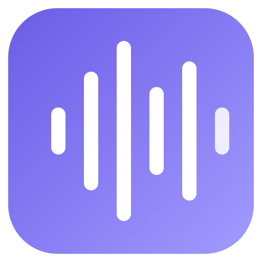

<h2>Glasscribe</h2>

Real-time, on-device speech-to-text for Mac. 22+ languages, live translation, floating subtitle overlay — 100% offline.

  

 

## About

**Glasscribe** is a lightweight macOS menu bar app that transcribes speech in real time — entirely on your device. Capture system audio or microphone input across 22+ languages with real-time translation. No cloud, no account, no data ever leaves your Mac.

Built on Apple's native Speech framework (macOS 26 Tahoe), Glasscribe delivers fast, private transcription with a clean, minimal interface that stays out of your way.

https://github.com/user-attachments/assets/4d9cf8ad-611c-49e5-979e-5f1cdcd3ced0

## Key Features

- **Real-time Transcription** — Live speech-to-text from system audio or microphone with instant results.
- **100% On-device** — All processing happens locally. No internet required, no audio data leaves your Mac. Ever.
- **22+ Languages** — English, Korean, Japanese, Chinese, Spanish, French, German, Arabic, Russian, and many more.
- **Live Translation** — Real-time on-device translation between all supported languages.
- **Floating Subtitle Overlay** — Draggable, resizable transparent overlay with confirmed lines, search, and translation.
- **System Audio Capture** — Transcribe YouTube, Zoom, podcasts, or any audio playing on your Mac. No virtual audio drivers needed.
- **Dictation Mode** — Hold the `fn` key to dictate. Release to paste text at the cursor position instantly.
- **Auto Copy & Paste** — Automatically copy transcriptions to clipboard or paste directly at your cursor.
- **Session History** — Searchable transcript history with timestamps, word count, and persistent sessions across restarts.
- **Export** — Save transcripts as Plain Text (.txt) or SRT Subtitles (.srt).
- **Keyboard Shortcuts** — Configurable global hotkeys for all major actions (⌃⌥S to toggle recording, and more).
- **Customizable Overlay** — Adjustable opacity, font size, accent color, auto-hide, and always-on-top options.
- **Automatic Updates** — Built-in Sparkle updater checks for new versions automatically.

## Privacy

Glasscribe is built with privacy as a core principle:

- 🔒 **No cloud processing** — Speech recognition runs entirely on Apple's on-device neural engine.
- 🚫 **No account required** — No sign-up, no login, no personal data collection.
- 📡 **No network requests** — Audio never leaves your device (except for optional license validation).
- 🗑️ **No data retention** — Session data is stored locally and only on your Mac.

## Supported Languages

### Transcription (22+ languages)
Korean, English, Japanese, Chinese (Mandarin), Cantonese, Arabic, Danish, German, Spanish, Finnish, French, Hebrew, Italian, Malay, Norwegian, Dutch, Portuguese, Russian, Swedish, Thai, Turkish, Vietnamese

### Translation
All transcription languages plus Hindi, Indonesian, Polish, Ukrainian, Chinese (Traditional)

## Getting Started

### Download
1. Visit **[glasscribe.toolab.dev](https://glasscribe.toolab.dev)** to download the latest version.
2. Open the `.dmg` file and drag Glasscribe to your Applications folder.
3. Launch Glasscribe — it appears as a waveform icon in your menu bar.

### Permissions
Glasscribe requires the following macOS permissions:
- **Microphone** — For microphone transcription and dictation mode.
- **Screen & System Audio Recording** — For system audio capture.
- **Accessibility** (optional) — For auto-paste at cursor functionality.

### Quick Start
1. Click the menu bar icon to open the Glasscribe panel.
2. Select your language and audio source (System Audio or Microphone).
3. Press **Start** or use the keyboard shortcut `⌃⌥S` to begin transcription.
4. View live transcriptions in the floating overlay window.

## Pricing

Glasscribe offers a **3-day free trial** with full access to all features.

| Plan | Price | |
|------|-------|-|
| Monthly | $2.90/month | |
| Annual | $12.00/year | Save 66% |
| **Lifetime** | **$24.00** | **One-time purchase** ⭐ |

<a href="https://glasscribe.toolab.dev/#pricing"><b>View pricing →</b></a>

## System Requirements

- **macOS 26 (Tahoe)** or later

## Keyboard Shortcuts

| Action | Default Shortcut |
|--------|-----------------|
| Toggle Recording | `⌃⌥S` |
| Toggle Auto Copy | `⌃⌥C` |
| Toggle Auto Paste | `⌃⌥V` |
| Toggle Overlay | `⌃⌥O` |
| Dictation | Hold `fn` |

All shortcuts are fully customizable in Settings.

## Links

- 🌐 **Website:** [glasscribe.toolab.dev](https://glasscribe.toolab.dev)
- 📝 **Release Notes:** [glasscribe.toolab.dev/whatsnew](https://glasscribe.toolab.dev/whatsnew)
- 📧 **Contact:** [contact@toolab.dev](mailto:contact@toolab.dev)
- 📜 **Terms of Service:** [glasscribe.toolab.dev/terms](https://glasscribe.toolab.dev/terms)
- 🔐 **Privacy Policy:** [glasscribe.toolab.dev/privacy](https://glasscribe.toolab.dev/privacy)

---

Made by <a href="https://toolab.dev">toolab.dev</a>

